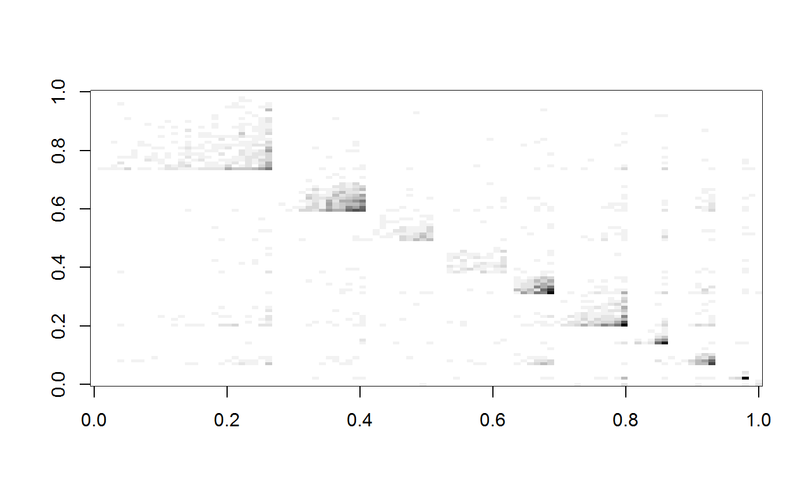
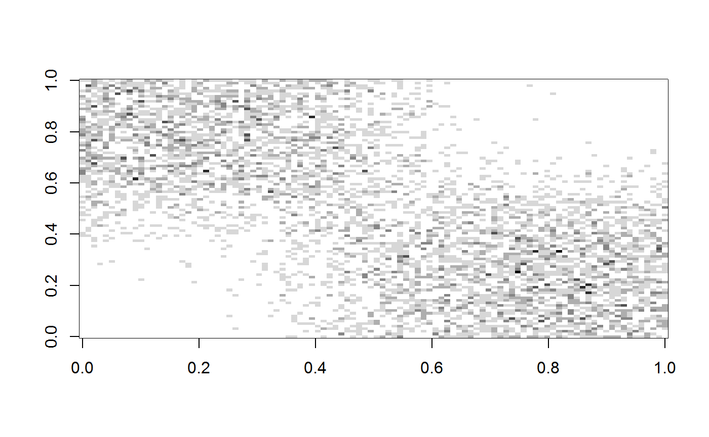
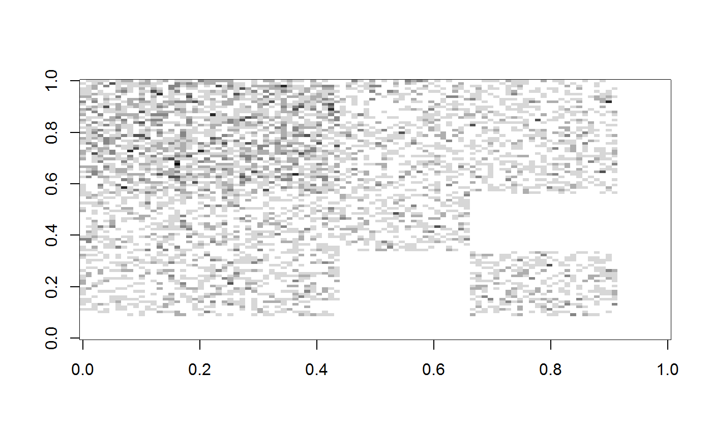
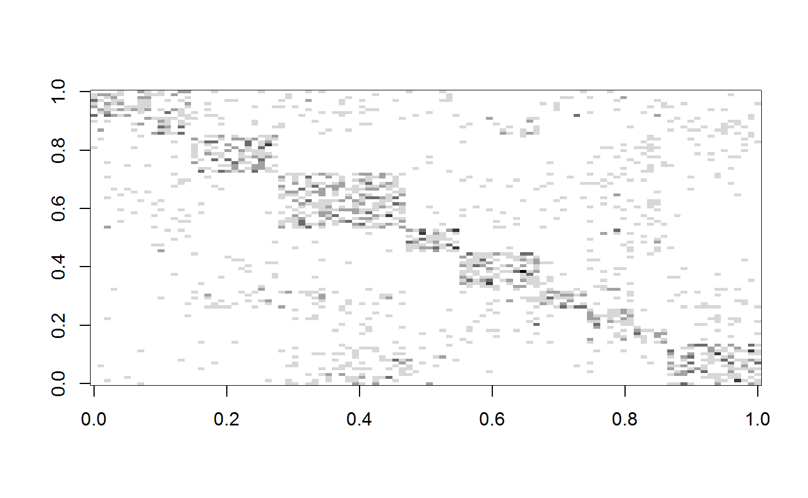
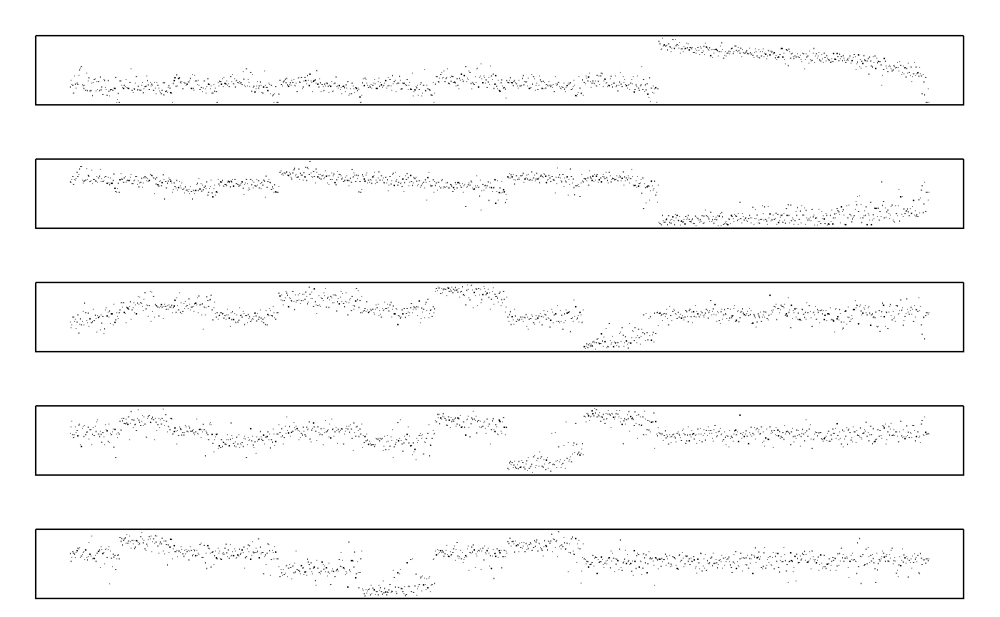

<!-- README.md is generated from README.Rmd. Please edit that file -->

# fastRG

<!-- badges: start -->

<!-- badges: end -->

`fastRG` quickly samples a broad class of network models known as
generalized random product graphs. In particular, for matrices `X`, `S`
and `Y`, `fastRG` samples a matrix `A` with expectation `X S Y^T` where
individual entries are Poisson distributed. We recommend that you think
of `A` as the adjacency matrix for a graph (or a multi-graph).
Crucially, the sampling is `O(m)`, where `m` is the number of the edges
in graph. Other algorithms are `O(n^2)`, where `n` is the number of
nodes in the network. For additional details, please have a look at the
[paper](https://arxiv.org/abs/1703.02998).

## Installation

`fastRG` is not yet on CRAN. You can install the development version
with:

``` r
# install.package("devtools")
devtools::install_github("karlrohe/fastRG")
```

## Example Usage

The easiest way to use `fastRG` is to use wrapper functions that sample
from population graph models. For example, to sample from an Erdos-Renyi
graph `n = 1,000,000` nodes and expected degree 5, we can use the `er()`
function.

``` r
library(fastRG)
#> Loading required package: Matrix

A <- er(n = 10^6, avgDeg = 5)
```

By default we always get a `Matrix::sparseMatrix()`, but if we can also
ask for the graph as an edgelist as well. This results in a fast way to
create `igraph` objects using `igraph::graph_from_edgelist()`.

``` r
library(fastRG)
library(igraph)
#> 
#> Attaching package: 'igraph'
#> The following object is masked from 'package:fastRG':
#> 
#>     sbm
#> The following objects are masked from 'package:stats':
#> 
#>     decompose, spectrum
#> The following object is masked from 'package:base':
#> 
#>     union

n <- 10000
K <- 5

X <- matrix(rpois(n = n * K, 1), nrow = n)
S <- matrix(runif(n = K * K, 0, .0001), nrow = K)

howManyEdges(X, S)
#> $em
#> [1] 102554.1
#> 
#> $avDeg
#> [1] 10.25541
#> 
#> $density
#> [1] 0.001025541
A <- fastRG(X, S, simple = TRUE)

el <- fastRG(X, S, simple = TRUE, returnEdgeList = TRUE)
g <- graph_from_edgelist(el)
```

`fastRG()` also allows for simulating from graph with `E(A) = X S Y^T`,
where `A` and `S` could be rectangular. This is helpful for bipartite
graphs or matrices of features.

``` r
n <- 10000
d <- 1000
K1 <- 5
K2 <- 3

X <- matrix(rpois(n = n * K1, 1), nrow = n)
Y <- matrix(rpois(n = d * K2, 1), nrow = d)
S <- matrix(runif(n = K1 * K2, 0, .1), nrow = K1)

A <- fastRG(X, S, Y, avgDeg = 10)
```

or

``` r
K <- 10
n <- 500
pi <- rexp(K) + 1
pi <- pi / sum(pi) * 3
B <- matrix(rexp(K^2) + 1, nrow = K)
diag(B) <- diag(B) + mean(B) * K
theta <- rexp(n)

A <- dcsbm(theta, pi, B, avgDeg = 50)
# here is the average degree:
mean(rowSums(A))
#> [1] 50.228

# If we remove multiple edges, the avgDeg parameter is not trustworthy:
A <- dcsbm(theta, pi, B, avgDeg = 50, PoissonEdges = FALSE)
mean(rowSums(A))
#> [1] 33.994

# but it is a good upper bound when the graph is sparse:
n <- 10000
A <- dcsbm(rexp(n), pi, B, avgDeg = 50, PoissonEdges = FALSE)
mean(rowSums(A))
#> [1] 48.4552
```

or

``` r
# This draws a 100 x 100 adjacency matrix from each model.
#   Each image might take around 5 seconds to render.

K <- 10
n <- 100
pi <- rexp(K) + 1
pi <- pi / sum(pi) * 3
B <- matrix(rexp(K^2) + 1, nrow = K)
diag(B) <- diag(B) + mean(B) * K
theta <- rexp(n)
A <- dcsbm(theta, pi, B, avgDeg = 50)
image(as.matrix(t(A[, n:1])), col = grey(seq(1, 0, len = 20)))
#> Warning in seq.default(1, 0, len = 20): partial argument match of 'len' to
#> 'length.out'
```



``` r


K <- 2
n <- 100
alpha <- c(1, 1) / 5
B <- diag(c(1, 1))
theta <- n
A <- dcMixed(theta, alpha, B, avgDeg = 50)
image(as.matrix(t(A[, theta:1])) / max(A), col = grey(seq(1, 0, len = 20)))
#> Warning in seq.default(1, 0, len = 20): partial argument match of 'len' to
#> 'length.out'
```



``` r


n <- 100
K <- 2
pi <- c(.7, .7)
B <- diag(c(1, 1))
theta <- n
A <- dcOverlapping(theta, pi, B, avgDeg = 50)
image(as.matrix(t(A[, n:1])) / max(A), col = grey(seq(1, 0, len = 20)))
#> Warning in seq.default(1, 0, len = 20): partial argument match of 'len' to
#> 'length.out'
```



``` r

K <- 10
n <- 100
pi <- rexp(K) + 1
pi <- pi / sum(pi)
B <- matrix(rexp(K^2), nrow = K)
B <- B / (3 * max(B))
diag(B) <- diag(B) + mean(B) * K
A <- fastRG::sbm(n, pi, B)
image(as.matrix(t(A[, n:1])) / max(A), col = grey(seq(1, 0, len = 20)))
#> Warning in seq.default(1, 0, len = 20): partial argument match of 'len' to
#> 'length.out'
```



Next sample a DC-SBM with 10,000 nodes. Then compute and plot the
leading eigenspace.

``` r
library(RSpectra)

K <- 10
n <- 10000
pi <- rexp(K) + 1
pi <- pi / sum(pi)
pi <- -sort(-pi)
B <- matrix(rexp(K^2) + 1, nrow = K)
diag(B) <- diag(B) + mean(B) * K
A <- dcsbm(rgamma(n, shape = 2, scale = .4), pi, B, avgDeg = 20, simple = T)
mean(rowSums(A))
#> [1] 19.8604

# leading eigen of regularized Laplacian with tau = 1
D <- Diagonal(n, 1 / sqrt(rowSums(A) + 1))
ei <- eigs_sym(D %*% A %*% D, 10)

# normalize the rows of X:
X <- t(apply(ei$vectors[, 1:K], 1, function(x) return(x / sqrt(sum(x^2) + 1 / n))))

par(mfrow = c(5, 1), mar = c(1, 2, 2, 2), xaxt = "n", yaxt = "n")

# plot 1000 elements of the leading eigenvectors:
s <- sort(sample(n, 1000))
for (i in 1:5) {
  plot(X[s, i], pch = ".")
}
```



or

``` r
# This samples a 1M node graph.
# Depending on the computer, sampling the graph should take between 10 and 30 seconds
#   Then, taking the eigendecomposition of the regularized graph laplacian should take between 1 and 3 minutes
# The resulting adjacency matrix is a bit larger than 100MB.
# The leading eigenvectors of A are highly localized
K <- 3
n <- 1000000
pi <- rexp(K) + 1
pi <- pi / sum(pi)
pi <- -sort(-pi)
B <- matrix(rexp(K^2) + 1, nrow = K)
diag(B) <- diag(B) + mean(B) * K
A <- dcsbm(rgamma(n, shape = 2, scale = .4), pi, B, avgDeg = 10)
D <- Diagonal(n, 1 / sqrt(rowSums(A) + 10))
L <- D %*% A %*% D
ei <- eigs_sym(L, 4)

s <- sort(sample(n, 10000))
X <- t(apply(ei$vectors[, 1:K], 1, function(x) return(x / sqrt(sum(x^2) + 1 / n))))
plot(X[s, 3]) # highly localized eigenvectors
```

To sample from a degree corrected and node contextualized graph…

``` r
n <- 10000 # number of nodes
d <- 1000 # number of features
K <- 5 # number of blocks

# Here are the parameters for the graph:

pi <- rexp(K) + 1
pi <- pi / sum(pi) * 3
B <- matrix(rexp(K^2) + 1, nrow = K)
diag(B) <- diag(B) + mean(B) * K
theta <- rexp(n)
paraG <- dcsbm(theta = theta, pi = pi, B = B, parametersOnly = T)


# Here are the parameters for the features:

thetaY <- rexp(d)
piFeatures <- rexp(K) + 1
piFeatures <- piFeatures / sum(piFeatures) * 3
BFeatures <- matrix(rexp(K^2) + 1, nrow = K)
diag(BFeatures) <- diag(BFeatures) + mean(BFeatures) * K

paraFeat <- dcsbm(theta = thetaY, pi = piFeatures, B = BFeatures, parametersOnly = T)

# the node "degrees" in the features, should be related to their degrees in the graph.
X <- paraG$X
X@x <- paraG$X@x + rexp(n) # the degree parameter should be different. X@x + rexp(n) makes feature degrees correlated to degrees in graph.

# generate the graph and features
A <- fastRG(paraG$X, paraG$S, avgDeg = 10)
features <- fastRG(X, paraFeat$S, paraFeat$X, avgDeg = 20)
```
