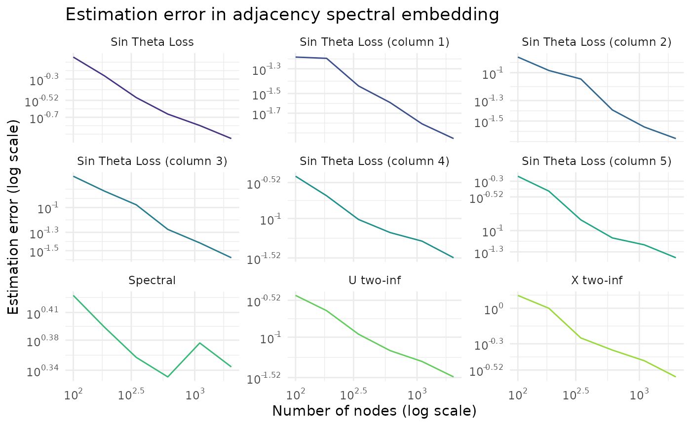
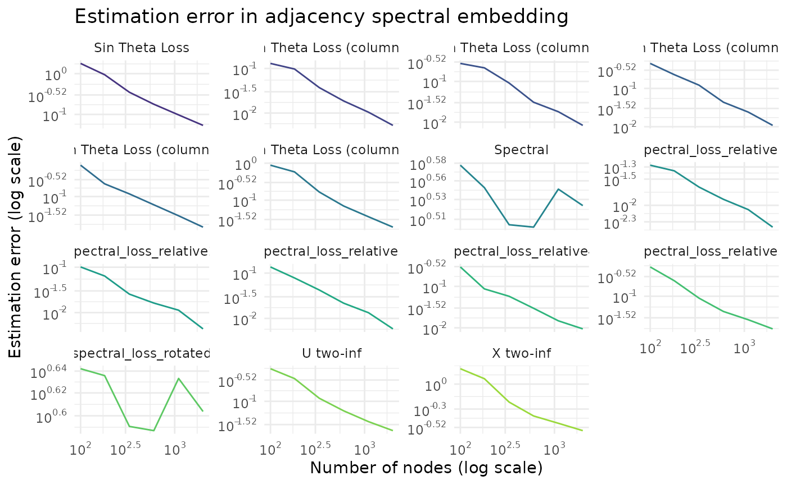
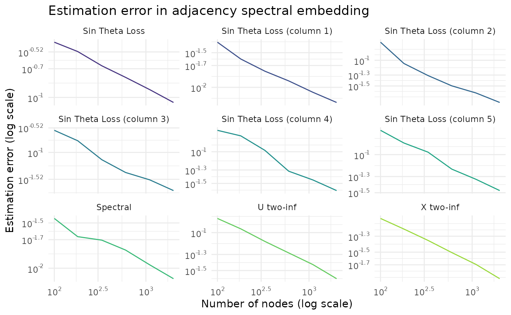

# Demonstration: simulation study

In this vignette we demonstrate how to use the `fastRG` package to study
the finite sample performance of two spectral estimators, the Adjacency
Spectral Embedding and the Laplacian Spectral Embedding.

We’ll consider how these estimators perform in two different cases: a
stochastic blockmodel where the signal eigenvalues are all
well-separated, and a stochastic blockmodel with exactly repeated
eigenvalues. We define the data generating process as follows:

``` r
library(dplyr)
library(ggplot2)
library(fastRG)
library(irlba)
library(Matrix)
library(purrr)
library(scales)
library(tidyr)

set.seed(27)

model_distinct <- function(n, k = 5) {
  B <- matrix(0.05, nrow = k, ncol = k)
  diag(B) <- seq(0.8, 0.4, length.out = k)
  latent <- dcsbm(
    theta = rexp(n) + 1,
    B = B,
    expected_degree = 2 * sqrt(n)
  )
}

model_repeated <- function(n, k = 5) {
  latent <- dcsbm(
    theta = rep(1, n),
    B = diag(0.5, k),
    expected_degree = 2 * sqrt(n)
  )
}
```

Now, if we want to compare the population singular values of the
distinct eigenvalue model with the sample singular values, we could do
so as follows:

``` r
# sample the latent parameters of the blockmodel
latent <- model_distinct(100)

# compute the population singular value decomposition of the blockmodel
s_pop <- svds(latent)

# sample a network conditional on the latent factors
A <- sample_sparse(latent)

# singular value decomposition of the observed network
s_obs <- irlba(A, 5)

# difference between population and sample singular values
s_pop$d - s_obs$d
#> [1] -2.9448036 -0.5316998 -0.1017457 -0.8889273 -3.3015227
```

That’s really it! To run a short simulation study, most of the remaining
work comes down to choosing various losses that you want to compute and
implemeting them in. The following chunk computes several losses that we
might care about:

- sin Theta loss for subspace spanned by all the singular vectors
- sin Theta loss for each individual singular vector
- two-to-infinity loss of the singular vectors, both scaled and unscaled
  by the square root of the singular values
- the spectral norm of the difference between the population and sample
  singular values

``` r
sin_theta_distance <- function(u, v) {
  s <- svd(crossprod(u, v))
  ncol(u) - sum(s$d^2)
}

two_to_infinity_loss <- function(X, Y) {
  s <- svd(crossprod(X, Y))
  rotation <- tcrossprod(s$v, s$u)
  Yrot <- Y %*% rotation
  diff <- X - Yrot
  max(sqrt(Matrix::rowSums(diff^2)))
}

loss_helper <- function(s_pop, s_obs) {
  u_pop <- s_pop$u
  u_obs <- s_obs$u

  d_pop <- s_pop$d
  d_obs <- s_obs$d

  x_pop <- u_pop %*% sqrt(diag(d_pop))
  x_obs <- u_obs %*% sqrt(diag(d_obs))

  # spectral norm difference of pop and obs, simplified computation
  # since d_pop and d_obs are diagonal
  spectral_loss <- max(abs(d_pop - d_obs))

  k <- ncol(u_pop)

  column_sin_theta_loss <- map_dbl(
    1:k,
    \(j) {
      sin_theta_distance(u_pop[, j, drop = FALSE], u_obs[, j, drop = FALSE])
    }
  )

  tibble(
    sin_theta_loss = sin_theta_distance(u_pop, u_obs),
    u_two_inf_loss = two_to_infinity_loss(u_pop, u_obs),
    x_two_inf_loss = two_to_infinity_loss(x_pop, x_obs),
    spectral_loss = spectral_loss,
    sin_theta_loss1 = column_sin_theta_loss[1],
    sin_theta_loss2 = column_sin_theta_loss[2],
    sin_theta_loss3 = column_sin_theta_loss[3],
    sin_theta_loss4 = column_sin_theta_loss[4],
    sin_theta_loss5 = column_sin_theta_loss[5]
  )
}
```

With these tools in handle, we can define a simulation runner. Since
this is just a basic simulation, we aren’t too worried about
computational efficiency, and we create a grid of sample sizes, crossed
with replication indices. Then we compute out hearts out.

``` r

run_simulation <- function(model, num_reps = 30) {
  expand_grid(
    n = c(100, 180, 330, 600, 1100, 2000),
    reps = 1:num_reps
  ) |>
    mutate(
      pop = map(n, model),
      s_pop = map(pop, svds),
      A = map(pop, sample_sparse),
      s_obs = map(A, irlba, 5), # rank five svd,
      loss = map2(s_pop, s_obs, loss_helper)
    )
}

sims <- run_simulation(model_distinct)
sims
#> # A tibble: 180 × 7
#>        n  reps pop        s_pop        A                s_obs        loss    
#>    <dbl> <int> <list>     <list>       <list>           <list>       <list>  
#>  1   100     1 <undrctd_> <named list> <dsCMatrx[,100]> <named list> <tibble>
#>  2   100     2 <undrctd_> <named list> <dsCMatrx[,100]> <named list> <tibble>
#>  3   100     3 <undrctd_> <named list> <dsCMatrx[,100]> <named list> <tibble>
#>  4   100     4 <undrctd_> <named list> <dsCMatrx[,100]> <named list> <tibble>
#>  5   100     5 <undrctd_> <named list> <dsCMatrx[,100]> <named list> <tibble>
#>  6   100     6 <undrctd_> <named list> <dsCMatrx[,100]> <named list> <tibble>
#>  7   100     7 <undrctd_> <named list> <dsCMatrx[,100]> <named list> <tibble>
#>  8   100     8 <undrctd_> <named list> <dsCMatrx[,100]> <named list> <tibble>
#>  9   100     9 <undrctd_> <named list> <dsCMatrx[,100]> <named list> <tibble>
#> 10   100    10 <undrctd_> <named list> <dsCMatrx[,100]> <named list> <tibble>
#> # ℹ 170 more rows
```

Now we’d like to summarize the results across the 30 different runs of
the simulation, so we write a short helper to do this as well.

``` r
summarize_simulations <- function(sims) {
  sims |>
    unnest_wider(c(loss)) |>
    select(contains("loss"), everything()) |>
    summarize(
      across(contains("loss"), mean),
      .by = n
    ) |>
    pivot_longer(
      contains("loss"),
      names_to = "loss_type",
      values_to = "loss"
    ) |>
    mutate(
      loss_type = recode(
        loss_type,
        "sin_theta_loss" = "Sin Theta Loss",
        "u_two_inf_loss" = "U two-inf",
        "x_two_inf_loss" = "X two-inf",
        "spectral_loss" = "Spectral",
        "sin_theta_loss1" = "Sin Theta Loss (column 1)",
        "sin_theta_loss2" = "Sin Theta Loss (column 2)",
        "sin_theta_loss3" = "Sin Theta Loss (column 3)",
        "sin_theta_loss4" = "Sin Theta Loss (column 4)",
        "sin_theta_loss5" = "Sin Theta Loss (column 5)"
      )
    )
}

results <- summarize_simulations(sims)
results
#> # A tibble: 54 × 3
#>        n loss_type                   loss
#>    <dbl> <chr>                      <dbl>
#>  1   100 Sin Theta Loss            0.848 
#>  2   100 U two-inf                 0.347 
#>  3   100 X two-inf                 1.28  
#>  4   100 Spectral                  2.73  
#>  5   100 Sin Theta Loss (column 1) 0.0636
#>  6   100 Sin Theta Loss (column 2) 0.147 
#>  7   100 Sin Theta Loss (column 3) 0.239 
#>  8   100 Sin Theta Loss (column 4) 0.363 
#>  9   100 Sin Theta Loss (column 5) 0.588 
#> 10   180 Sin Theta Loss            0.542 
#> # ℹ 44 more rows
```

And now that we have our results, all that remains is to plot them.

``` r
plot_results <- function(results) {
  results |>
    ggplot() +
    aes(x = n, y = loss, color = loss_type) +
    geom_line() +
    scale_x_log10(labels = label_log(digits = 2)) +
    scale_y_log10(labels = label_log(digits = 2)) +
    scale_color_viridis_d(begin = 0.15, end = 0.85, guide = "none") +
    facet_wrap(vars(loss_type), scales = "free_y") +
    labs(
      title = "Estimation error in adjacency spectral embedding",
      y = "Estimation error (log scale)",
      x = "Number of nodes (log scale)"
    ) +
    theme_minimal()
}

plot_results(results)
```



Here we see that all of our losses are decreasing except for the
spectral loss, which is exactly what we would expect from theory.

Since we defined helpers to run the simulations for us, when we want to
see results for the model with repeated eigenvalues, it’s as
straightforward as:

``` r
model_repeated |>
  run_simulation() |>
  summarize_simulations() |>
  plot_results()
```



Now we see that we can only recover the subspace spanned by the singular
vectors, but not the singular vectors themselves, exactly as expected.

Here’s one last trick. We might also be interested in using a different
estimator, the Laplacian Spectral Embedding, to recover the singular
value decomposition of the expected (degree-normalized, regularized)
graph Laplacian. This is also straightforward using `fastRG`.

``` r
graph_laplacian <- function(A) {
  degrees <- rowSums(A)
  tau <- mean(degrees)
  DA <- rowScale(A, 1 / sqrt(degrees + tau))
  colScale(DA, 1 / sqrt(degrees + tau))
}

svds_laplacian <- function(pop) {
  # regularize by expected mean degree (scalar)
  tau <- expected_degree(pop)
  # vector!!
  degrees_pop <- expected_degrees(pop)

  # rescale X in the population model so that XSX' is the expected
  # graph Laplacian. we can't use this to sample networks anymore, but
  # we can use it to bootstrap a population SVD calculation
  pop$X <- rowScale(pop$X, 1 / sqrt(degrees_pop + tau))
  svds(pop)
}

run_laplacian_simulation <- function(model, num_reps = 30) {
  expand_grid(
    n = c(100, 180, 330, 600, 1100, 2000),
    reps = 1:num_reps
  ) |>
    mutate(
      pop = map(n, model),
      s_pop = map(pop, svds_laplacian),
      A = map(pop, sample_sparse),
      L = map(A, graph_laplacian),
      s_obs = map(L, irlba, 5), # rank five svd,
      loss = map2(s_pop, s_obs, loss_helper)
    )
}
```

With our helpers defined we’re once again off to the races and see that
Laplacian Spectral Embedding also does well

``` r
model_distinct |>
  run_laplacian_simulation() |>
  summarize_simulations() |>
  plot_results()
```


